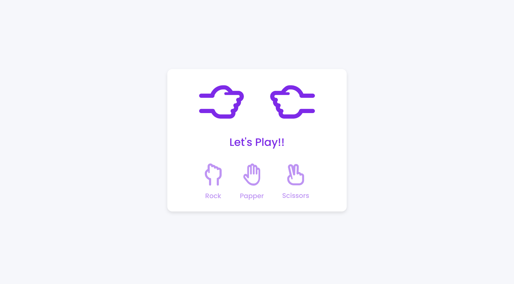

# Rock Paper Scissors Game

A simple and clean Rock-Paper-Scissors game built with **HTML, CSS, and JavaScript**.
This project is great for beginners who want to practice DOM manipulation, game logic, and UI design.

---

## 📸 Preview


---

## 🎥 Demo Video

You can watch the full walkthrough and demo on YouTube:

👉 [https://youtu.be/lEPMi5wbgMs?si=k8s463BF1NRc-QAr](https://youtu.be/lEPMi5wbgMs?si=k8s463BF1NRc-QAr)

---

## 🧠 Features

* Beginner-friendly code structure
* Fast and lightweight (no frameworks)
* Great for learning JavaScript fundamentals

---

## 🛠️ Technologies Used

* HTML5
* CSS3
* JavaScript

---

## 🧑‍💻 Getting Started

To run this project locally:

```bash
git clone https://github.com/amirmohamaddev666/Rock-Paper-Scissors.git
cd rock-paper-scissors
```

Then open `index.html` in your browser.

---

## ⭐ Support

If you liked this project:

* ⭐ Star the repository
* 🍴 Fork it
* 📢 Share with friends

Made with ❤️ by Amir Mohammad
